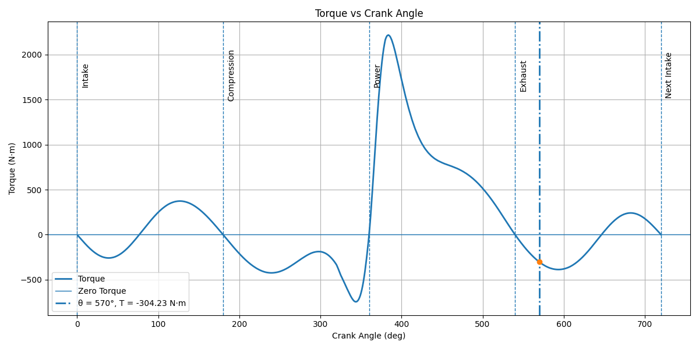
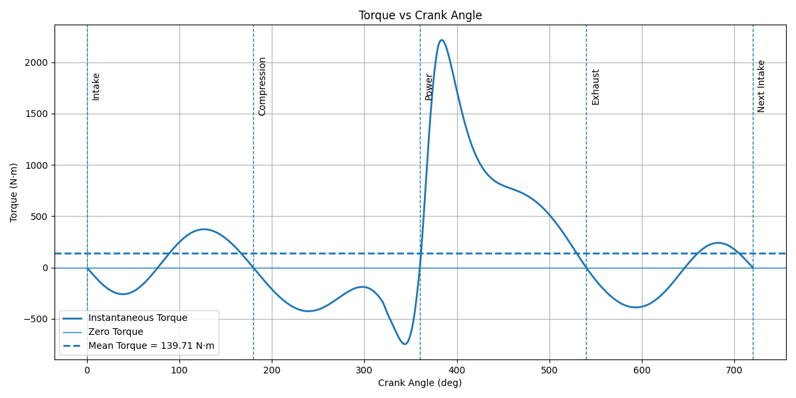
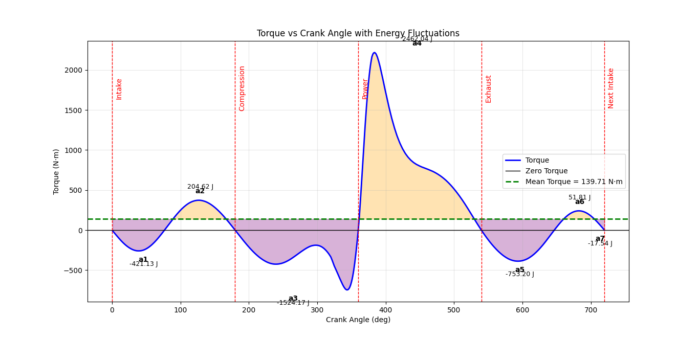

# Flywheel Energy Fluctuation Analysis for a Reciprocating Engine

This repository contains Python scripts developed to analyze the **torque variation**, **mean torque**, and **energy fluctuation** of a **four-stroke single-cylinder reciprocating engine**.  
The analysis is based on cylinder pressure data and crank–slider kinematics and is suitable for **flywheel design and speed fluctuation studies**.

---

## Author
**Thilac01**

---

## Project Overview

The project performs the following analyses:

- Torque variation with crank angle
- Work done per cycle
- Mean torque calculation
- Energy fluctuation during an engine cycle
- Identification of maximum energy deviation for flywheel sizing

The scripts use **real pressure–crank angle data** and include the effect of **reciprocating inertia forces**.

---

---

## Output Results

The following figures show the key results obtained from each analysis script.

---

### 1. Torque vs Crank Angle

**File:** `Torque_Vs_Crank_Angle.py`

This plot shows the instantaneous torque variation over one full 720° crank cycle, including intake, compression, power, and exhaust strokes.



---

### 2. Mean Torque Calculation

**File:** `Mean_Torque.py`

This plot includes the instantaneous torque curve along with the calculated **mean torque line**, obtained by integrating the torque over the engine cycle.



---

### 3. Energy Fluctuation Analysis

**File:** `Energy_fluctuation.py`

This plot shows the cumulative energy variation throughout the crank cycle.  
The maximum difference between peak and minimum energy represents the **maximum energy fluctuation**, used for flywheel design.



---


## Repository Structure

```text
.
├── Torque_Vs_Crank_Angle.py
├── Mean_Torque.py
├── Energy_fluctuation.py
├── data.xlsx
├── outputs/
│   ├── PIC1.png
│   ├── PIC2.png
│   └── PIC3.png
└── README.md


